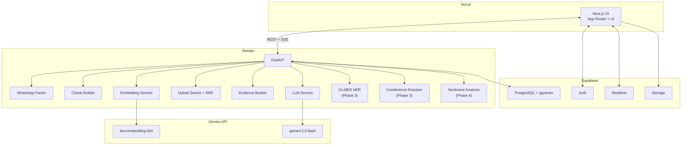

# AI Memory Engine — Complete Implementation Plan

> **Version**: 2.0 (Rewritten)  
> **Date**: August 6, 2026  
> **Scope**: WhatsApp-only, all 6 phases — complete product  
> **Architecture**: Next.js 15 (Vercel) + FastAPI (Render) + Supabase  
> **Status**: Awaiting Approval

---

## Locked-In Decisions

| Decision | Choice | Rationale |
|:---|:---|:---|
| Scope | WhatsApp .txt only | Go deep, not wide |
| Backend | FastAPI (Python) from day 1 | Developer comfort + Python NLP ecosystem |
| Frontend | Next.js 15 on Vercel | App Router, streaming, SSR |
| Database | Supabase (PostgreSQL + pgvector) | Managed, Auth built-in, Realtime |
| LLM & Embeddings | Gemini free API (`gemini-2.5-flash` + `text-embedding-004`) | Free, multilingual |
| Embedding strategy | Conversation window chunking (5-10 msgs/chunk) | 10x fewer vectors, higher quality |
| RLS | Denormalized `user_id` on all hot-path tables | Fast vector search |
| Search weighting | Vector search weighted 1.2x over FTS in RRF | Urdu/Hinglish support |
| Thread detection | Adaptive gap (median-based threshold) | Chat-rhythm-aware |
| Job status | Supabase Realtime subscriptions | No polling |
| Evidence expansion | Thread-bounded ±N messages | No cross-conversation contamination |

---

## Architecture



---

## Repository Structure

```
ai-memory-engine/
├── frontend/                        # → Vercel
│   ├── app/
│   │   ├── layout.tsx               # Root layout, fonts, theme
│   │   ├── page.tsx                 # Dashboard
│   │   ├── login/page.tsx           # Auth page
│   │   ├── upload/page.tsx          # WhatsApp file upload
│   │   ├── chat/[chatId]/page.tsx   # Message browser
│   │   ├── search/page.tsx          # AI Q&A interface
│   │   ├── investigate/page.tsx     # AI Detective (Phase 5)
│   │   └── story/[chatId]/page.tsx  # Story Mode (Phase 4)
│   ├── components/
│   │   ├── ui/                      # Design system primitives
│   │   ├── MessageBubble.tsx
│   │   ├── MessageList.tsx
│   │   ├── ChatSidebar.tsx
│   │   ├── SearchBar.tsx
│   │   ├── UploadDropzone.tsx
│   │   ├── QueryChat.tsx            # AI chat component
│   │   ├── StreamingResponse.tsx
│   │   ├── CitationCard.tsx
│   │   ├── EmotionGraph.tsx         # Phase 4
│   │   ├── RelationshipGraph.tsx    # Phase 3
│   │   ├── MemoryCard.tsx           # Phase 4
│   │   ├── StoryChapter.tsx         # Phase 4
│   │   ├── InvestigationReport.tsx  # Phase 5
│   │   └── AliasReviewPanel.tsx     # Phase 3 — HITL alias confirmation
│   ├── lib/
│   │   ├── supabase/
│   │   │   ├── client.ts
│   │   │   ├── server.ts
│   │   │   └── middleware.ts
│   │   ├── api.ts                   # FastAPI client
│   │   └── utils.ts
│   ├── package.json
│   └── next.config.ts
│
├── backend/                         # → Render
│   ├── app/
│   │   ├── main.py                  # FastAPI entry
│   │   ├── config.py                # Settings
│   │   ├── dependencies.py          # Auth dependency (JWT validation)
│   │   ├── models/
│   │   │   ├── message.py
│   │   │   ├── search.py
│   │   │   ├── chat.py
│   │   │   └── job.py
│   │   ├── routers/
│   │   │   ├── parse.py
│   │   │   ├── search.py
│   │   │   ├── chat.py              # Streaming Q&A
│   │   │   ├── analytics.py         # Phase 4
│   │   │   ├── investigate.py       # Phase 5
│   │   │   └── alias_suggestions.py # Phase 3 — HITL alias review endpoints
│   │   ├── services/
│   │   │   ├── whatsapp_parser.py   # WhatsApp-specific, no abstraction
│   │   │   ├── thread_detector.py   # Adaptive gap detection
│   │   │   ├── chunk_builder.py     # Conversation window chunking
│   │   │   ├── embedding.py         # Gemini embedding service
│   │   │   ├── hybrid_search.py     # Vector + FTS + RRF
│   │   │   ├── evidence_builder.py  # Thread-bounded context assembly
│   │   │   ├── llm.py               # Gemini LLM streaming
│   │   │   ├── entity_extractor.py  # GLiNER (Phase 3)
│   │   │   ├── coreference.py       # Alias resolution (Phase 3)
│   │   │   ├── sentiment.py         # Emotion labeling (Phase 4)
│   │   │   ├── event_detector.py    # Ghosting, fights, etc. (Phase 4)
│   │   │   ├── story_generator.py   # Story Mode (Phase 4)
│   │   │   └── investigator.py      # AI Detective (Phase 5)
│   │   ├── db/
│   │   │   ├── connection.py        # asyncpg pool
│   │   │   └── queries/
│   │   │       ├── messages.py
│   │   │       ├── search.py
│   │   │       ├── people.py
│   │   │       ├── graph.py         # Recursive CTEs (Phase 3)
│   │   │       └── analytics.py     # Phase 4
│   │   └── workers/
│   │       └── ingestion.py         # Background pipeline
│   ├── tests/
│   │   ├── test_parser.py
│   │   ├── test_search.py
│   │   └── sample_exports/          # Test WhatsApp files
│   ├── requirements.txt
│   └── Dockerfile
│
└── supabase/
    └── migrations/
        └── 001_schema.sql
```

---

# PHASE 1 — FOUNDATIONS

> Upload WhatsApp .txt → parse → store → browse → keyword search

---

## Step 1: Project Scaffolding

### 1a. Frontend (Next.js)
```bash
npx -y create-next-app@latest ./frontend --typescript --eslint --app --src-dir=false --import-alias="@/*"
```
**Dependencies**: `@supabase/supabase-js`, `@supabase/ssr`, `react-dropzone`, `date-fns`, `recharts`, `lucide-react`

### 1b. Backend (FastAPI)
```
requirements.txt:
fastapi>=0.115
uvicorn[standard]
python-multipart
asyncpg
supabase
pydantic>=2.0
python-dotenv
sse-starlette
httpx
```

### 1c. Environment Configuration
```env
# Both services
SUPABASE_URL=
SUPABASE_ANON_KEY=
SUPABASE_SERVICE_ROLE_KEY=     # backend only
SUPABASE_DB_URL=               # backend only (direct Postgres connection string)
GEMINI_API_KEY=                # backend only

# Frontend only
NEXT_PUBLIC_SUPABASE_URL=
NEXT_PUBLIC_SUPABASE_ANON_KEY=
NEXT_PUBLIC_API_URL=           # Render backend URL
```

**Verify**: `npm run dev` and `uvicorn app.main:app --reload` both start clean.

---

## Step 2: Supabase Schema

> [!NOTE]
> All hot-path tables have `user_id` denormalized for fast RLS. The `message_chunks` table replaces the old `embeddings` table.

### Full migration SQL:

```sql
CREATE EXTENSION IF NOT EXISTS "vector";
CREATE EXTENSION IF NOT EXISTS "uuid-ossp";

-- PROFILES (extends Supabase Auth)
CREATE TABLE public.profiles (
    id          UUID PRIMARY KEY REFERENCES auth.users(id) ON DELETE CASCADE,
    email       TEXT,
    full_name   TEXT,
    created_at  TIMESTAMPTZ DEFAULT NOW()
);

-- Auto-create profile on signup
CREATE OR REPLACE FUNCTION public.handle_new_user()
RETURNS TRIGGER AS $$
BEGIN
    INSERT INTO public.profiles (id, email, full_name)
    VALUES (NEW.id, NEW.email, NEW.raw_user_meta_data->>'full_name');
    RETURN NEW;
END;
$$ LANGUAGE plpgsql SECURITY DEFINER;

CREATE TRIGGER on_auth_user_created
    AFTER INSERT ON auth.users
    FOR EACH ROW EXECUTE FUNCTION public.handle_new_user();

-- CHATS
CREATE TABLE public.chats (
    id                UUID PRIMARY KEY DEFAULT uuid_generate_v4(),
    user_id           UUID NOT NULL REFERENCES public.profiles(id) ON DELETE CASCADE,
    name              TEXT NOT NULL,
    participant_count INTEGER DEFAULT 2,
    message_count     INTEGER DEFAULT 0,
    first_message_at  TIMESTAMPTZ,
    last_message_at   TIMESTAMPTZ,
    metadata          JSONB DEFAULT '{}',
    created_at        TIMESTAMPTZ DEFAULT NOW()
);

-- PEOPLE
CREATE TABLE public.people (
    id              UUID PRIMARY KEY DEFAULT uuid_generate_v4(),
    user_id         UUID NOT NULL REFERENCES public.profiles(id) ON DELETE CASCADE,
    canonical_name  TEXT NOT NULL,
    message_count   INTEGER DEFAULT 0,
    first_seen_at   TIMESTAMPTZ,
    last_seen_at    TIMESTAMPTZ,
    profile         JSONB DEFAULT '{}',
    created_at      TIMESTAMPTZ DEFAULT NOW()
);

-- ALIASES
CREATE TABLE public.aliases (
    id          UUID PRIMARY KEY DEFAULT uuid_generate_v4(),
    user_id     UUID NOT NULL,  -- denormalized
    person_id   UUID NOT NULL REFERENCES public.people(id) ON DELETE CASCADE,
    alias       TEXT NOT NULL,
    confidence  FLOAT DEFAULT 1.0,
    created_at  TIMESTAMPTZ DEFAULT NOW(),
    UNIQUE(person_id, alias)
);

-- MESSAGES
CREATE TABLE public.messages (
    id            UUID PRIMARY KEY DEFAULT uuid_generate_v4(),
    user_id       UUID NOT NULL,  -- denormalized
    chat_id       UUID NOT NULL REFERENCES public.chats(id) ON DELETE CASCADE,
    person_id     UUID REFERENCES public.people(id) ON DELETE SET NULL,
    sender_name   TEXT NOT NULL,
    timestamp     TIMESTAMPTZ NOT NULL,
    content       TEXT NOT NULL,
    is_system_msg BOOLEAN DEFAULT FALSE,
    is_media      BOOLEAN DEFAULT FALSE,
    metadata      JSONB DEFAULT '{}',
    search_vector TSVECTOR,
    created_at    TIMESTAMPTZ DEFAULT NOW()
);

-- Auto-populate tsvector
CREATE OR REPLACE FUNCTION update_search_vector()
RETURNS TRIGGER AS $$
BEGIN
    NEW.search_vector := to_tsvector('simple', COALESCE(NEW.content, ''));
    RETURN NEW;
END;
$$ LANGUAGE plpgsql;

CREATE TRIGGER messages_search_vector_trigger
    BEFORE INSERT OR UPDATE OF content ON public.messages
    FOR EACH ROW EXECUTE FUNCTION update_search_vector();

-- Indexes
CREATE INDEX idx_messages_search ON public.messages USING GIN(search_vector);
CREATE INDEX idx_messages_chat ON public.messages(chat_id);
CREATE INDEX idx_messages_person ON public.messages(person_id);
CREATE INDEX idx_messages_ts ON public.messages(timestamp);
CREATE INDEX idx_messages_user ON public.messages(user_id);

-- CONVERSATION THREADS
CREATE TABLE public.conversation_threads (
    id            UUID PRIMARY KEY DEFAULT uuid_generate_v4(),
    user_id       UUID NOT NULL,  -- denormalized
    chat_id       UUID NOT NULL REFERENCES public.chats(id) ON DELETE CASCADE,
    start_time    TIMESTAMPTZ NOT NULL,
    end_time      TIMESTAMPTZ NOT NULL,
    message_count INTEGER DEFAULT 0,
    summary       TEXT,
    created_at    TIMESTAMPTZ DEFAULT NOW()
);

CREATE TABLE public.message_threads (
    message_id UUID NOT NULL REFERENCES public.messages(id) ON DELETE CASCADE,
    thread_id  UUID NOT NULL REFERENCES public.conversation_threads(id) ON DELETE CASCADE,
    PRIMARY KEY (message_id, thread_id)
);

-- MESSAGE CHUNKS (conversation window embeddings)
CREATE TABLE public.message_chunks (
    id               UUID PRIMARY KEY DEFAULT uuid_generate_v4(),
    user_id          UUID NOT NULL,  -- denormalized for fast RLS
    chat_id          UUID NOT NULL REFERENCES public.chats(id) ON DELETE CASCADE,
    thread_id        UUID REFERENCES public.conversation_threads(id) ON DELETE SET NULL,
    start_message_id UUID NOT NULL,
    end_message_id   UUID NOT NULL,
    start_time       TIMESTAMPTZ NOT NULL,
    end_time         TIMESTAMPTZ NOT NULL,
    content          TEXT NOT NULL,           -- concatenated messages
    embedding        HALFVEC(768),            -- Gemini text-embedding-004
    message_ids      UUID[] NOT NULL,         -- all messages in this chunk
    message_count    INTEGER NOT NULL,
    created_at       TIMESTAMPTZ DEFAULT NOW()
);

-- HNSW index for vector search
CREATE INDEX idx_chunks_hnsw ON public.message_chunks
    USING hnsw (embedding halfvec_cosine_ops)
    WITH (m = 16, ef_construction = 64);

CREATE INDEX idx_chunks_chat ON public.message_chunks(chat_id);
CREATE INDEX idx_chunks_user ON public.message_chunks(user_id);

-- EVENTS (Phase 4)
CREATE TABLE public.events (
    id          UUID PRIMARY KEY DEFAULT uuid_generate_v4(),
    user_id     UUID NOT NULL,
    chat_id     UUID REFERENCES public.chats(id) ON DELETE CASCADE,
    type        TEXT NOT NULL,
    description TEXT,
    detected_at TIMESTAMPTZ,
    evidence    JSONB DEFAULT '[]',
    people_ids  UUID[] DEFAULT '{}',
    confidence  FLOAT DEFAULT 0.0,
    created_at  TIMESTAMPTZ DEFAULT NOW()
);

-- RELATIONSHIPS (graph edges — Phase 3)
CREATE TABLE public.relationships (
    id                UUID PRIMARY KEY DEFAULT uuid_generate_v4(),
    user_id           UUID NOT NULL,
    person_a_id       UUID NOT NULL REFERENCES public.people(id) ON DELETE CASCADE,
    person_b_id       UUID NOT NULL REFERENCES public.people(id) ON DELETE CASCADE,
    relationship_type TEXT NOT NULL,
    strength          FLOAT DEFAULT 0.0,
    first_detected    TIMESTAMPTZ,
    last_detected     TIMESTAMPTZ,
    metadata          JSONB DEFAULT '{}',
    created_at        TIMESTAMPTZ DEFAULT NOW(),
    UNIQUE(person_a_id, person_b_id, relationship_type)
);

-- ANALYSIS CACHE
CREATE TABLE public.analysis_cache (
    id          UUID PRIMARY KEY DEFAULT uuid_generate_v4(),
    user_id     UUID NOT NULL,
    chat_id     UUID REFERENCES public.chats(id) ON DELETE CASCADE,
    person_id   UUID REFERENCES public.people(id) ON DELETE CASCADE,
    metric_type TEXT NOT NULL,
    data        JSONB NOT NULL,
    computed_at TIMESTAMPTZ DEFAULT NOW()
);

-- INGESTION JOBS
CREATE TABLE public.ingestion_jobs (
    id                  UUID PRIMARY KEY DEFAULT uuid_generate_v4(),
    user_id             UUID NOT NULL REFERENCES public.profiles(id) ON DELETE CASCADE,
    chat_id             UUID REFERENCES public.chats(id) ON DELETE SET NULL,
    status              TEXT NOT NULL DEFAULT 'pending',
    file_name           TEXT,
    total_messages      INTEGER DEFAULT 0,
    processed_messages  INTEGER DEFAULT 0,
    current_step        TEXT DEFAULT 'waiting',
    error_message       TEXT,
    started_at          TIMESTAMPTZ,
    completed_at        TIMESTAMPTZ,
    created_at          TIMESTAMPTZ DEFAULT NOW()
);

-- EMOTION LABELS (Phase 4)
CREATE TABLE public.emotion_labels (
    id         UUID PRIMARY KEY DEFAULT uuid_generate_v4(),
    user_id    UUID NOT NULL,
    message_id UUID NOT NULL REFERENCES public.messages(id) ON DELETE CASCADE,
    emotion    TEXT NOT NULL,  -- happy, sad, angry, romantic, awkward, jealous, supportive, confused
    score      FLOAT DEFAULT 0.0,
    created_at TIMESTAMPTZ DEFAULT NOW()
);

-- ALIAS SUGGESTIONS (Human-in-the-Loop feedback)
CREATE TABLE public.alias_suggestions (
    id              UUID PRIMARY KEY DEFAULT uuid_generate_v4(),
    user_id         UUID NOT NULL,
    suggested_alias TEXT NOT NULL,          -- the detected name/nickname (e.g., "Abd")
    suggested_person_id UUID REFERENCES public.people(id) ON DELETE CASCADE,  -- who we think it is
    status          TEXT NOT NULL DEFAULT 'pending',  -- pending, accepted, rejected, new_person
    confidence      FLOAT DEFAULT 0.0,     -- model confidence (0-1)
    evidence_message_ids UUID[] DEFAULT '{}',  -- messages that triggered this suggestion
    context_snippet TEXT,                   -- short conversation excerpt for user review
    resolved_at     TIMESTAMPTZ,
    created_at      TIMESTAMPTZ DEFAULT NOW()
);

CREATE INDEX idx_alias_suggestions_pending
    ON public.alias_suggestions(user_id) WHERE status = 'pending';

-- ============================================
-- ROW LEVEL SECURITY (all using denormalized user_id)
-- ============================================
ALTER TABLE public.profiles ENABLE ROW LEVEL SECURITY;
ALTER TABLE public.chats ENABLE ROW LEVEL SECURITY;
ALTER TABLE public.people ENABLE ROW LEVEL SECURITY;
ALTER TABLE public.aliases ENABLE ROW LEVEL SECURITY;
ALTER TABLE public.messages ENABLE ROW LEVEL SECURITY;
ALTER TABLE public.conversation_threads ENABLE ROW LEVEL SECURITY;
ALTER TABLE public.message_threads ENABLE ROW LEVEL SECURITY;
ALTER TABLE public.message_chunks ENABLE ROW LEVEL SECURITY;
ALTER TABLE public.events ENABLE ROW LEVEL SECURITY;
ALTER TABLE public.relationships ENABLE ROW LEVEL SECURITY;
ALTER TABLE public.analysis_cache ENABLE ROW LEVEL SECURITY;
ALTER TABLE public.ingestion_jobs ENABLE ROW LEVEL SECURITY;
ALTER TABLE public.emotion_labels ENABLE ROW LEVEL SECURITY;
ALTER TABLE public.alias_suggestions ENABLE ROW LEVEL SECURITY;

-- Simple, fast policies (no subqueries)
CREATE POLICY "own_data" ON public.profiles FOR ALL USING (auth.uid() = id);
CREATE POLICY "own_data" ON public.chats FOR ALL USING (auth.uid() = user_id);
CREATE POLICY "own_data" ON public.people FOR ALL USING (auth.uid() = user_id);
CREATE POLICY "own_data" ON public.aliases FOR ALL USING (auth.uid() = user_id);
CREATE POLICY "own_data" ON public.messages FOR ALL USING (auth.uid() = user_id);
CREATE POLICY "own_data" ON public.conversation_threads FOR ALL USING (auth.uid() = user_id);
CREATE POLICY "own_data" ON public.message_chunks FOR ALL USING (auth.uid() = user_id);
CREATE POLICY "own_data" ON public.events FOR ALL USING (auth.uid() = user_id);
CREATE POLICY "own_data" ON public.relationships FOR ALL USING (auth.uid() = user_id);
CREATE POLICY "own_data" ON public.analysis_cache FOR ALL USING (auth.uid() = user_id);
CREATE POLICY "own_data" ON public.ingestion_jobs FOR ALL USING (auth.uid() = user_id);
CREATE POLICY "own_data" ON public.emotion_labels FOR ALL USING (auth.uid() = user_id);
CREATE POLICY "own_data" ON public.alias_suggestions FOR ALL USING (auth.uid() = user_id);

-- message_threads needs a join (acceptable — not a hot-path table)
CREATE POLICY "own_data" ON public.message_threads FOR ALL USING (
    message_id IN (SELECT id FROM public.messages WHERE user_id = auth.uid())
);

-- Enable Realtime on ingestion_jobs for live progress
ALTER PUBLICATION supabase_realtime ADD TABLE public.ingestion_jobs;

-- Enable Realtime on alias_suggestions for review notifications
ALTER PUBLICATION supabase_realtime ADD TABLE public.alias_suggestions;
```

**Verify**: All tables visible in Supabase Table Editor. RLS active (green lock icons).

---

## Step 3: FastAPI Foundation

**Files**: `main.py`, `config.py`, `dependencies.py`, `db/connection.py`

**Deliverables**:
- FastAPI app with CORS configured for Vercel frontend domain
- `asyncpg` connection pool to Supabase direct connection string
- JWT validation dependency that extracts `user_id` from Supabase tokens
- `GET /api/health` returning `{"status": "ok", "db": "connected"}`

**Verify**: Health endpoint returns 200 with DB connected.

---

## Step 4: Supabase Auth (Frontend)

**Files**: `lib/supabase/client.ts`, `lib/supabase/server.ts`, `middleware.ts`, `app/login/page.tsx`

**Deliverables**:
- Email/password signup and login
- Session management via cookies (SSR-compatible)
- Middleware protecting all routes except `/login`
- Profile auto-creation via database trigger (Step 2)

**Verify**: Sign up → login → redirected to dashboard → log out → redirected to login.

---

## Step 5: WhatsApp Parser

**File**: `backend/app/services/whatsapp_parser.py`

No abstractions. One file. Optimized specifically for WhatsApp `.txt` exports.

**Regex patterns to support**:
```python
PATTERNS = [
    # DD/MM/YYYY, HH:MM - Sender: Message
    r'(\d{1,2}/\d{1,2}/\d{2,4}),\s(\d{1,2}:\d{2}(?::\d{2})?(?:\s?[APap][Mm])?)\s-\s(.+?):\s(.+)',
    # [DD/MM/YYYY, HH:MM:SS] Sender: Message
    r'\[(\d{1,2}/\d{1,2}/\d{2,4}),\s(\d{1,2}:\d{2}(?::\d{2})?(?:\s?[APap][Mm])?)\]\s(.+?):\s(.+)',
]
```

**Edge cases**:
- Multi-line messages (continuation lines appended to previous message)
- System messages (no colon after sender): `"Messages are end-to-end encrypted"`, `"X added Y"`
- Media markers: `<Media omitted>`, `<image omitted>`, `<video omitted>` → `is_media = True`
- Deleted messages: `"This message was deleted"` / `"You deleted this message"`
- Unicode: Urdu script, emoji, Hinglish mixed content
- Streaming parse: process line-by-line, never load entire file into memory
- Date format detection: auto-detect DD/MM vs MM/DD from first few lines

**Output**: List of dicts with `sender_name`, `timestamp`, `content`, `is_system_msg`, `is_media`.

**Verify**: Parse a real WhatsApp export with 10K+ messages. All edge cases handled. < 2s for 100K messages.

---

## Step 6: File Upload Flow

**Frontend**: `app/upload/page.tsx`, `components/UploadDropzone.tsx`
**Backend**: `app/routers/parse.py`

**Flow**:
```
User drops .txt file → POST /api/parse/whatsapp (multipart + JWT)
  → FastAPI validates JWT, creates ingestion_job (status: 'pending')
  → Returns 202 { job_id }
  → Background task starts processing
  → Frontend subscribes via Supabase Realtime to ingestion_jobs updates
  → Status updates stream live: parsing → storing → threading → complete
  → On complete: frontend redirects to /chat/{chatId}
```

**Supabase Realtime subscription** (no polling):
```typescript
supabase
  .channel(`job-${jobId}`)
  .on('postgres_changes', {
    event: 'UPDATE', schema: 'public',
    table: 'ingestion_jobs', filter: `id=eq.${jobId}`
  }, (payload) => {
    setStatus(payload.new.status);
    setProgress(payload.new.processed_messages);
    setStep(payload.new.current_step);
  })
  .subscribe();
```

**Verify**: Upload a file. Real-time progress bar updates without polling. Redirects on completion.

---

## Step 7: Ingestion Pipeline (Background Worker)

**File**: `backend/app/workers/ingestion.py`

**Pipeline steps** (each step updates `ingestion_jobs.current_step`):

1. **Parse** → call `whatsapp_parser.py`, get list of parsed messages
2. **Create People** → extract unique sender names → create `people` rows + initial `aliases`
3. **Create Chat** → with name from filename or detected participants
4. **Bulk Insert Messages** → batch INSERT in chunks of 500 via `asyncpg.copy_records_to_table`
   - Set `user_id` on every message (denormalized)
   - Map `sender_name` → `person_id` via alias lookup
5. **Update Chat Stats** → `message_count`, `first_message_at`, `last_message_at`
6. **Update People Stats** → `message_count`, `first_seen_at`, `last_seen_at`
7. **Run Thread Detection** → (Step 8)
8. **Update job** → `status: 'complete'`

All steps wrapped in a try/except that sets `status: 'failed'` with `error_message` on any failure.

**Verify**: 50K messages ingest in < 30 seconds. All data correct in Supabase Table Editor.

---

## Step 8: Adaptive Thread Detection

**File**: `backend/app/services/thread_detector.py`

**Algorithm**:
```python
def detect_threads(messages: list[dict]) -> list[list[dict]]:
    """Group messages into conversation threads using adaptive gap detection."""
    if len(messages) < 2:
        return [messages]
    
    # Calculate all gaps
    gaps = []
    for i in range(1, len(messages)):
        gap_seconds = (messages[i]['timestamp'] - messages[i-1]['timestamp']).total_seconds()
        gaps.append(gap_seconds)
    
    # Adaptive threshold: 10x median gap, clamped to [30min, 4hours]
    median_gap = statistics.median(gaps)
    threshold = max(median_gap * 10, 1800)   # minimum 30 minutes
    threshold = min(threshold, 14400)         # maximum 4 hours
    
    # Split into threads
    threads = [[messages[0]]]
    for i, gap in enumerate(gaps):
        if gap > threshold:
            threads.append([])
        threads[-1].append(messages[i + 1])
    
    return threads
```

**Runs as Step 7 of the ingestion pipeline**: creates `conversation_threads` records and `message_threads` junction entries.

**Verify**: Threads correspond to natural conversation breaks. Thread count is reasonable (not too many, not too few).

---

## Step 9: Message Browser UI

**Files**: `app/page.tsx` (dashboard), `app/chat/[chatId]/page.tsx`, `components/MessageBubble.tsx`, `components/MessageList.tsx`, `components/ChatSidebar.tsx`

**Dashboard** (`/`):
- Grid of chat cards showing: name, message count, date range, participant count, last message preview
- Upload button linking to `/upload`

**Chat View** (`/chat/[chatId]`):
- Sidebar: list of all chats (clickable)
- Main area: scrollable message list
- Messages color-coded by sender (auto-assigned from a curated palette)
- Date headers separating messages by day
- System messages rendered as centered, muted text
- Infinite scroll pagination (load 100 messages per page)
- **Direct Supabase client queries** for reads — no backend round-trip

**Design**:
- Dark theme, glassmorphism card backgrounds
- Gradient accents, smooth scroll animations
- Google Font: Inter or Outfit
- Sender color palette: curated jewel tones (not random)

**Verify**: Navigate between chats. Messages display correctly. Smooth scrolling with 10K+ messages.

---

## Step 10: Full-Text Search + Basic Stats

**Search** (`components/SearchBar.tsx` inside chat view):
- Debounced input → queries `messages.search_vector` via Supabase client
- Results highlighted with `ts_headline('simple', content, query)`
- Click a result → scrolls to that message in the chat view
- Uses `'simple'` config (best available for multilingual — vector search will do the heavy multilingual lifting in Phase 2)

**Basic Stats** (displayed on dashboard cards + chat header):
- Total messages, messages per person, most active day
- Messages per day chart (using `recharts`)
- Computed during ingestion (Step 7), stored in `analysis_cache`

**Verify**: Search for known words/names → results appear highlighted. Stats match raw counts.

---

## Phase 1 Checkpoint ✓

At this point you have a working app:
- [x] Sign up / log in
- [x] Upload WhatsApp .txt file with real-time progress
- [x] Browse messages in a chat-like UI
- [x] Search by keyword
- [x] Basic statistics dashboard
- [x] Conversations auto-grouped into threads
- [x] Data isolated per user (RLS)

---

# PHASE 2 — AI SEARCH

> Ask natural language questions → get evidence-backed, streaming answers

---

## Step 11: Conversation Window Chunk Builder

**File**: `backend/app/services/chunk_builder.py`

**Algorithm**:
1. For each `conversation_thread`, retrieve its messages in order
2. Create sliding windows of **8 messages** with **3-message overlap**
3. Format each window as a concatenated string:
   ```
   [14:32] Aimi: acha
   [14:32] Aimi: phir?
   [14:33] You: kuch nahi
   [14:33] You: 👍
   [14:34] Aimi: okay
   [14:35] You: chal btao what happened
   [14:36] Aimi: nothing yaar just tired
   [14:37] You: same lol
   ```
4. Store as `message_chunks` rows with `message_ids` array, `thread_id`, timestamps
5. Skip chunks that are entirely system messages or media

**Why 8 messages with 3 overlap?**
- 8 messages = enough context for semantic meaning
- 3-message overlap = no conversation edges get lost between chunks
- Overlap ensures that if a key message is at the boundary, it appears in two chunks

**Runs after thread detection in the ingestion pipeline.**

**Verify**: 100K messages → ~12.5K chunks (minus skipped system/media). Each chunk is a readable conversation snippet.

---

## Step 12: Embedding Generation

**File**: `backend/app/services/embedding.py`

```python
import google.genai as genai

client = genai.Client(api_key=GEMINI_API_KEY)

async def embed_batch(texts: list[str]) -> list[list[float]]:
    """Embed a batch of texts using Gemini text-embedding-004."""
    response = client.models.embed_content(
        model="text-embedding-004",
        contents=texts,
    )
    return [e.values for e in response.embeddings]
```

**Integration**:
- After chunks are built (Step 11), batch-embed all chunks
- Gemini supports up to 100 texts per batch call
- Rate limiting: implement exponential backoff for 429 errors
- Update `message_chunks.embedding` column with the vectors
- Job status: `embedding` step in the ingestion pipeline

**Verify**: All chunks have embeddings. Dimensions are 768. HNSW index is active and populated.

---

## Step 13: Hybrid Search Engine

**File**: `backend/app/services/hybrid_search.py`

Three parallel queries fused via RRF:

**1. Vector Search** (semantic — weighted 1.2x):
```sql
SELECT mc.id, mc.content, mc.message_ids, mc.start_time, mc.end_time,
       1 - (mc.embedding <=> $1::halfvec) AS similarity
FROM public.message_chunks mc
WHERE mc.user_id = $2 AND mc.chat_id = $3
ORDER BY mc.embedding <=> $1::halfvec
LIMIT 25;
```

**2. Full-Text Search** (lexical — weighted 1.0x):
```sql
SELECT m.id, m.content, m.sender_name, m.timestamp,
       ts_rank(m.search_vector, query) AS text_rank
FROM public.messages m,
     plainto_tsquery('simple', $1) AS query
WHERE m.user_id = $2 AND m.chat_id = $3 AND m.search_vector @@ query
ORDER BY text_rank DESC
LIMIT 25;
```

**3. Sender Match** (if query mentions a name):
```sql
SELECT m.id, m.content, m.sender_name, m.timestamp
FROM public.messages m
JOIN public.aliases a ON m.person_id = a.person_id
WHERE m.user_id = $1 AND m.chat_id = $2
  AND LOWER(a.alias) ILIKE $3
ORDER BY m.timestamp DESC
LIMIT 15;
```

**RRF Fusion** (in Python):
```python
def rrf_fuse(result_lists: list[tuple[list, float]], k: int = 60) -> list:
    """Fuse multiple ranked lists with per-list weights."""
    scores = {}
    for results, weight in result_lists:
        for rank, item in enumerate(results, 1):
            item_id = item["id"]
            scores[item_id] = scores.get(item_id, 0) + weight / (k + rank)
    return sorted(scores.items(), key=lambda x: x[1], reverse=True)[:20]

# Usage:
fused = rrf_fuse([
    (vector_results, 1.2),   # higher weight for multilingual
    (fts_results, 1.0),
    (sender_results, 0.8),
])
```

**Endpoint**: `POST /api/search/hybrid`

**Verify**: Test with multilingual queries. Vector search finds Urdu content. FTS catches exact English terms. Fusion outperforms either alone.

---

## Step 14: Evidence Builder

**File**: `backend/app/services/evidence_builder.py`

Takes hybrid search results → produces structured evidence for the LLM:

1. **Collect matched chunks** from vector search results
2. **Collect matched individual messages** from FTS results
3. **Expand context**: for each individual message match, fetch all messages from the **same thread** (thread-bounded, not just ±N by timestamp)
4. **Merge and deduplicate** by message ID
5. **Sort chronologically** (LLM needs temporal order)
6. **Format as evidence blocks**:
   ```
   === Evidence Block 1 (March 5, 2026 — Thread #47) ===
   [14:32] Aimi: i cant believe he did that
   [14:33] You: who? abdullah?
   [14:33] Aimi: yes wo banda
   >>> [14:35] Aimi: hes been ignoring everyone since last week  ← MATCHED
   [14:36] You: why tho
   [14:37] Aimi: idk but hes changed since that fight
   ```
7. **Cap at ~4000 tokens** total (free tier Gemini context budget)

**Verify**: Evidence blocks are coherent conversation snippets. No cross-thread contamination. Matched messages are highlighted.

---

## Step 15: LLM Streaming Q&A

**Files**: `backend/app/services/llm.py`, `backend/app/routers/chat.py`

**System prompt**:
```
You are the AI Memory Engine — a relationship detective that reconstructs 
conversations from evidence. You analyze WhatsApp chat history.

RULES:
1. ONLY answer based on the provided evidence. Never invent facts.
2. ALWAYS cite evidence block numbers and timestamps.
3. If evidence is insufficient, say so explicitly.
4. The chat may be in English, Urdu, Hinglish, or mixed. Understand all.
5. Respond in whichever language the user asks in.
6. Be empathetic — this is personal life history.
7. For timeline questions, arrange analysis chronologically.
```

**Streaming via SSE** (`sse-starlette`):
```python
@router.post("/api/chat")
async def chat(request: ChatRequest, user_id: str = Depends(get_user_id)):
    async def event_generator():
        # Step 1: Status update
        yield {"event": "status", "data": json.dumps({"step": "searching"})}
        
        # Step 2: Hybrid search
        results = await hybrid_search(request.query, request.chat_id, user_id)
        yield {"event": "status", "data": json.dumps({
            "step": "found", "count": len(results)
        })}
        
        # Step 3: Build evidence
        evidence = await build_evidence(results, user_id)
        yield {"event": "evidence", "data": json.dumps(evidence.to_dict())}
        
        # Step 4: Stream LLM response
        async for token in stream_gemini(request.query, evidence):
            yield {"event": "token", "data": json.dumps({"content": token})}
        
        yield {"event": "done", "data": "{}"}
    
    return EventSourceResponse(event_generator())
```

**Verify**: Ask a question → see status updates → answer streams token-by-token → citations are correct.

---

## Step 16: Chat Q&A Interface (Frontend)

**Files**: `app/search/page.tsx`, `components/QueryChat.tsx`, `components/StreamingResponse.tsx`, `components/CitationCard.tsx`

**UI**:
- Chat selector dropdown (which chat to query)
- Text input for natural language questions
- Status indicators: "Searching..." → "Found 18 messages across 6 threads" → "Analyzing..."
- Streaming response with typing animation + cursor blink
- Citation cards below the answer (sender, timestamp, message preview)
- Click a citation → opens `/chat/[chatId]` scrolled to that exact message
- Collapsible "Evidence" panel showing raw evidence blocks

**Verify**: Full end-to-end Q&A flow. Answers are relevant, cited, streaming.

---

## Phase 2 Checkpoint ✓

- [x] Everything from Phase 1 +
- [x] Messages chunked into conversation windows with embeddings
- [x] Hybrid search (vector + FTS + sender match) with RRF fusion
- [x] Evidence builder assembles thread-bounded context
- [x] Natural language Q&A with streaming answers and citations
- [x] Multilingual support (Urdu, English, Hinglish)

---

# PHASE 3 — INTELLIGENCE

> The system understands *who* people are and *how* they're connected

---

## Step 17: GLiNER Entity Extraction

**File**: `backend/app/services/entity_extractor.py`
**New dependency**: `gliner` (pip)

- Install GLiNER (~205M params, runs locally on CPU)
- Process all messages through GLiNER with labels: `["Person", "Location", "Event", "Topic"]`
- Run as a batch post-processing step (not during initial ingestion — too slow for first upload)
- Store extracted entities as metadata on messages or in a new `entity_mentions` junction table
- Resolve extracted "Person" entities against existing `people` records

**Verify**: GLiNER correctly identifies names, locations, and events in mixed English/Urdu text.

---

## Step 18: Coreference Resolution & Alias Detection (Human-in-the-Loop)

**Files**: `backend/app/services/coreference.py`, `backend/app/routers/alias_suggestions.py`, `frontend/components/AliasReviewPanel.tsx`

> [!IMPORTANT]
> **Core design principle**: Instead of silently auto-resolving ambiguous aliases with NLP (which will inevitably get Urdu/Hinglish wrong), the system generates **suggestions** and asks the user to confirm. One human click beats any amount of sophisticated NLP.

### 18a. Confidence-Tiered Resolution

During entity extraction (Step 17), every detected name/alias gets a confidence score:

| Confidence | Action | Example |
|:---|:---|:---|
| **High (> 0.85)** | Auto-merge silently | Exact substring: `"Abd"` → `"Abdullah"` (string contains match) |
| **Medium (0.5 – 0.85)** | Create `alias_suggestion` → **ask user** | `"wo banda"` might be Abdullah, but could be someone else |
| **Low (< 0.5)** | Skip — don't surface noise | Random pronoun with no clear referent |

### 18b. Suggestion Generation

```python
async def generate_alias_suggestions(user_id: str, chat_id: str):
    """Analyze entities and generate alias suggestions for user review."""
    
    # 1. Rule-based: string similarity against known people
    for entity in extracted_entities:
        best_match, score = fuzzy_match(entity.name, known_people)
        
        if score > 0.85:
            # Auto-create alias (high confidence)
            await create_alias(person_id=best_match.id, alias=entity.name, confidence=score)
        elif score > 0.5:
            # Surface for human review
            await create_suggestion(
                user_id=user_id,
                suggested_alias=entity.name,
                suggested_person_id=best_match.id,
                confidence=score,
                evidence_message_ids=entity.source_messages,
                context_snippet=build_context_snippet(entity.source_messages),
            )
    
    # 2. LLM-assisted: batch ambiguous cases through Gemini
    ambiguous = get_unresolved_entities(chat_id)
    if ambiguous:
        prompt = f"""Given these people in the chat: {known_people_names}
        Who do these references likely refer to?
        {format_ambiguous_with_context(ambiguous)}
        Respond as JSON: [{"alias": "...", "likely_person": "...", "confidence": 0.0-1.0}]"""
        
        suggestions = await call_gemini(prompt)
        for s in suggestions:
            if s.confidence > 0.5:
                await create_suggestion(...)
```

### 18c. Human Review UI

**Component**: `frontend/components/AliasReviewPanel.tsx`

The user sees a notification badge on the dashboard: **"3 aliases need your review"**

Clicking opens the Alias Review Panel:

```
┌─────────────────────────────────────────────────┐
│  🔍 Alias Review                     3 pending  │
├─────────────────────────────────────────────────┤
│                                                  │
│  Does "Abd" refer to Abdullah?                   │
│                                                  │
│  Context:                                        │
│  ┌──────────────────────────────────────────┐    │
│  │ [14:32] Aimi: abd ne kya kaha tha?       │    │
│  │ [14:33] You: usne kuch nahi bola          │    │
│  │ [14:34] Aimi: abd ko bol na               │    │
│  └──────────────────────────────────────────┘    │
│                                                  │
│  ┌─────────┐  ┌─────────┐  ┌────────────────┐   │
│  │ ✅ Yes  │  │ ❌ No   │  │ ➕ New Person  │   │
│  └─────────┘  └─────────┘  └────────────────┘   │
│                                                  │
│ ─ ─ ─ ─ ─ ─ ─ ─ ─ ─ ─ ─ ─ ─ ─ ─ ─ ─ ─ ─ ─ ─ │
│                                                  │
│  Does "wo banda" refer to Abdullah?              │
│  ...                                             │
└─────────────────────────────────────────────────┘
```

### 18d. User Actions

| Action | What Happens |
|:---|:---|
| **✅ Yes** | Create `aliases` row mapping `"Abd"` → `Abdullah`'s `person_id`. Update suggestion status to `accepted`. Re-link all messages containing this alias to the correct person. |
| **❌ No** | Mark suggestion as `rejected`. System learns not to suggest this pairing again. |
| **➕ New Person** | Create a new `people` record for this alias. The user can name them. Mark suggestion as `new_person`. |

### 18e. Backend Endpoints

**File**: `backend/app/routers/alias_suggestions.py`

| Endpoint | Method | Purpose |
|:---|:---|:---|
| `GET /api/suggestions/pending` | GET | List all pending alias suggestions for the user |
| `POST /api/suggestions/{id}/accept` | POST | Accept: create alias, re-link messages |
| `POST /api/suggestions/{id}/reject` | POST | Reject: dismiss suggestion |
| `POST /api/suggestions/{id}/new-person` | POST | Create new person from this alias |
| `POST /api/suggestions/batch` | POST | Accept/reject multiple at once |

### 18f. Live Notifications

Frontend subscribes to `alias_suggestions` via Supabase Realtime:
```typescript
supabase
  .channel('alias-suggestions')
  .on('postgres_changes', {
    event: 'INSERT', schema: 'public',
    table: 'alias_suggestions', filter: `user_id=eq.${userId}`
  }, (payload) => {
    setPendingCount(prev => prev + 1);
    showToast(`New alias detected: "${payload.new.suggested_alias}" — needs your review`);
  })
  .subscribe();
```

After entity extraction completes (Step 17), the user gets a live toast: *"5 new aliases detected — review them to improve accuracy."*

### 18g. Feedback Loop

User decisions feed back into the system:
- Accepted aliases improve future auto-resolution (confidence thresholds learn from patterns)
- Rejected aliases prevent repeat suggestions
- Over time, fewer suggestions surface as the system learns the user's contact graph

**Verify**: Upload a chat mentioning "Abdullah" and "Abd". System surfaces suggestion: *"Does 'Abd' refer to Abdullah?"* Click Yes → alias created → all "Abd" messages now linked to Abdullah's profile.

---

## Step 19: People Profiles (Auto-Generated)

**File**: `backend/app/services/people_profiles.py`

For each person, auto-generate a profile stored in `people.profile` (JSONB):
```json
{
  "summary": "Aimi is your close friend from university...",
  "message_count": 12400,
  "known_aliases": ["Aimi", "Aimi ji"],
  "first_interaction": "2025-03-12",
  "last_interaction": "2026-07-03",
  "top_topics": ["university", "exams", "relationships"],
  "communication_style": "frequent, informal, emoji-heavy",
  "typical_active_hours": "22:00-02:00"
}
```

Generated by prompting Gemini with a sample of the person's messages + extracted entities.

---

## Step 20: Relationship Graph (Recursive CTEs)

**File**: `backend/app/db/queries/graph.py`

**Populate relationships**: analyze co-occurrence of people within threads → create `relationships` edges:
- Two people mentioned in the same thread → `mentioned_together` edge
- Two people in a conversational exchange → `interacted` edge
- Frequency → `strength` score

**Multi-hop traversal** via recursive CTE:
```sql
WITH RECURSIVE connections AS (
    -- Base case: direct connections
    SELECT person_b_id AS person_id, relationship_type, strength, 1 AS depth
    FROM relationships WHERE person_a_id = $1 AND user_id = $2
    UNION ALL
    -- Recursive step
    SELECT r.person_b_id, r.relationship_type, r.strength, c.depth + 1
    FROM relationships r
    JOIN connections c ON r.person_a_id = c.person_id
    WHERE c.depth < 3 AND r.user_id = $2  -- max 3 hops
)
SELECT * FROM connections;
```

**Verify**: "Who is Abdullah?" returns direct + indirect connections with hop distances.

---

## Step 21: Interactive Relationship Graph UI

**File**: `components/RelationshipGraph.tsx`
**Library**: `d3-force` or `react-force-graph`

- Force-directed graph visualization
- Nodes = people, sized by message count
- Edges = relationships, thickness by strength
- Click a node → re-center graph on that person
- Click a node → show their profile card
- Hover → show relationship type labels

**Verify**: Graph renders with correct nodes and edges. Interactions feel responsive.

---

# PHASE 4 — INSIGHTS

> Automated behavioral analysis, emotions, Story Mode, Memory Cards

---

## Step 22: Sentiment & Emotion Analysis

**File**: `backend/app/services/sentiment.py`

- Use Gemini to label messages with emotions in batches:
  `Happy, Sad, Angry, Romantic, Awkward, Jealous, Supportive, Confused, Neutral`
- Batch process: send 20 messages per Gemini call with a structured output prompt
- Store in `emotion_labels` table
- Aggregate into time-series data for emotion graphs

---

## Step 23: Emotion Graphs & Conversation Health

**File**: `components/EmotionGraph.tsx`

- Time-series line chart plotting emotional trajectory per relationship
- X-axis: time (weeks/months). Y-axis: emotion intensity
- Composite "Conversation Health" metric: combines frequency + sentiment + reply latency
- Visual trajectory: Peak → Conflict → Distance → Recovery

---

## Step 24: Event Detection

**File**: `backend/app/services/event_detector.py`

Auto-detect events from combined signals:

| Event | Detection Signals |
|:---|:---|
| **Ghosting** | Reply latency spike (>5x rolling average) after negative sentiment |
| **Fight/Argument** | Cluster of "Angry" emotions + increased message frequency |
| **Celebration** | "Happy" cluster + birthday/event keywords |
| **Confession** | "Romantic" or "Supportive" shift + intimate topic keywords |
| **Distance** | Gradual decline in message frequency + sentiment cooling |

Store as `events` rows with evidence (message IDs) and confidence scores.

---

## Step 25: Memory Cards

**File**: `components/MemoryCard.tsx`, `backend/app/services/memory_cards.py`

AI-generated milestones:
- First conversation
- First use of a name/nickname
- First inside joke
- Longest conversation
- Most emotional day
- Most romantic exchange
- Longest silence and what broke it

Generated via Gemini prompt against extracted events and statistics.

---

## Step 26: Story Mode

**File**: `app/story/[chatId]/page.tsx`, `backend/app/services/story_generator.py`

Prompt: "Summarize my friendship with Aimi"

**Process**:
1. Collect all events, relationship trajectory, emotion timeline for this person
2. Identify major chronological arcs (phases of the relationship)
3. Prompt Gemini with structured context to generate chapters:
   - Chapter 1: How It Started
   - Chapter 2: Getting Closer
   - Chapter 3: Daily Life
   - Chapter 4: The Turbulence
   - Chapter 5: Where We Are Now
4. Every claim cites specific messages (linked as citation cards)

**UI**: Book-like reading experience with chapter navigation, embedded citations, emotion graph per chapter.

---

## Step 27: Statistics Dashboard Enhancement

Upgrade the basic stats from Phase 1:
- Most mentioned person, most emotional day, most romantic month
- Longest silence and who broke it
- Message frequency heatmap (day × hour)
- Reply speed distribution per person
- Word cloud (bilingual)

---

# PHASE 5 — AI DETECTIVE

> Investigation workspace for complex relational queries

---

## Step 28: Investigation Workspace

**File**: `app/investigate/page.tsx`, `components/InvestigationReport.tsx`

The AI Detective interface:
- Natural language investigation queries ("Trace every connection of Abdullah")
- System executes multi-hop graph traversal + hybrid search + timeline analysis
- Returns structured intelligence report:
  ```
  📊 Investigation Report: Abdullah
  ├── Direct mentions: 42
  ├── Indirect mentions (resolved): 18
  ├── Known aliases: Abd, Wo, Us
  ├── Connected people (1°): Aimi, Hashim, Ali
  ├── Timeline: [interactive timeline]
  ├── Relationship trajectory: Frequent → Central → Fading
  └── Key events: [clickable list with citations]
  ```

---

## Step 29: Multi-Hop Query Engine

**File**: `backend/app/services/investigator.py`

Combines:
1. Recursive CTE graph traversal (connections, hops)
2. Temporal analysis (when did this person appear/disappear?)
3. Frequency analysis (message volume over time for this entity)
4. Sentiment analysis (how does the user feel about this person over time?)
5. Evidence compilation (key messages about this person)

All synthesized by Gemini into a narrative investigation report.

---

## Step 30: Investigation Follow-Up Queries

The investigation workspace supports follow-up questions:
- "Did Aimi become distant after meeting Abdullah?"
  → System finds chronological intersection, measures delta in conversation frequency, presents conclusion with cited messages.

Uses conversation context (previous questions/answers) for multi-turn investigation.

---

# PHASE 6 — PRODUCTION

> Ship a secure, performant, resilient product that's ready for real users

---

## Step 31: Security Hardening

**Objective**: Lock down every attack surface before any user data enters the system.

### 31a. API Security Layer

**File**: `backend/app/middleware/security.py`

| Protection | Implementation |
|:---|:---|
| **Rate Limiting** | `slowapi` library — 30 req/min per user for search, 10 req/min for chat, 5 req/min for file upload |
| **Request Size Limits** | Max file upload: 50MB. Max request body: 1MB. Enforced in FastAPI + Nginx/Render |
| **CORS Lockdown** | Whitelist only your exact Vercel domain — no wildcards in production |
| **JWT Validation** | Verify Supabase JWT signature, expiry, and audience on every request. Reject malformed tokens. |
| **Input Sanitization** | Strip HTML/script tags from all user inputs before storage. Prevent XSS via stored content. |
| **File Validation** | Verify uploaded files are valid UTF-8 text. Reject binary files disguised as .txt. Max 500K lines. |

```python
from slowapi import Limiter
from slowapi.util import get_remote_address

limiter = Limiter(key_func=get_remote_address)

@router.post("/api/chat")
@limiter.limit("10/minute")
async def chat(request: Request, ...):
    ...
```

### 31b. Supabase Security

| Protection | Implementation |
|:---|:---|
| **RLS Verification** | Automated test: create User A and User B, verify A cannot read B's data across ALL tables |
| **Service Role Key** | NEVER exposed to frontend. Only used in FastAPI backend. Stored as Render env var. |
| **Anon Key Scope** | Frontend anon key can only read user's own data (RLS enforces this) |
| **SQL Injection** | All queries use parameterized `$1, $2` placeholders via `asyncpg` — never string concatenation |

### 31c. Content Security Headers

**File**: `frontend/next.config.ts`

```typescript
const securityHeaders = [
    { key: 'X-Content-Type-Options', value: 'nosniff' },
    { key: 'X-Frame-Options', value: 'DENY' },
    { key: 'X-XSS-Protection', value: '1; mode=block' },
    { key: 'Referrer-Policy', value: 'strict-origin-when-cross-origin' },
    { key: 'Permissions-Policy', value: 'camera=(), microphone=(), geolocation=()' },
    {
        key: 'Content-Security-Policy',
        value: "default-src 'self'; script-src 'self' 'unsafe-inline' 'unsafe-eval'; style-src 'self' 'unsafe-inline'; img-src 'self' data: blob:; connect-src 'self' https://*.supabase.co https://*.onrender.com;"
    }
];
```

**Verify**: Run `npx is-website-vulnerable` and OWASP ZAP baseline scan. Zero critical/high findings.

---

## Step 32: Differential Privacy for Embeddings (SPARSE)

**File**: `backend/app/services/privacy.py`

**Objective**: Prevent embedding inversion attacks — even if an attacker gains read access to the vector table, they cannot reconstruct the original message text.

### Implementation:

```python
import numpy as np

class SPARSEPrivacy:
    """Sensitivity-guided differential privacy for text embeddings."""
    
    def __init__(self, epsilon: float = 8.0, sensitive_dims_ratio: float = 0.3):
        self.epsilon = epsilon
        self.sensitive_dims_ratio = sensitive_dims_ratio
        self.sensitivity_mask = None
    
    def learn_sensitivity_mask(self, embedding_sample: np.ndarray):
        """Identify which dimensions encode sensitive attributes.
        
        Uses variance analysis: high-variance dimensions carry more 
        identity-specific information and need more noise.
        """
        dim_variance = np.var(embedding_sample, axis=0)
        threshold = np.percentile(dim_variance, (1 - self.sensitive_dims_ratio) * 100)
        self.sensitivity_mask = dim_variance >= threshold
    
    def apply_mahalanobis_noise(self, embedding: np.ndarray) -> np.ndarray:
        """Apply elliptical noise calibrated by dimension sensitivity.
        
        Sensitive dimensions get stronger noise (protecting private content).
        Non-sensitive dimensions get minimal noise (preserving search quality).
        """
        noise = np.random.normal(0, 1, embedding.shape)
        
        # Scale noise by sensitivity
        scale = np.where(
            self.sensitivity_mask,
            1.0 / self.epsilon,           # sensitive dims: more noise
            0.05 / self.epsilon            # non-sensitive: minimal noise
        )
        
        return embedding + noise * scale
```

### Integration:
1. After all embeddings are generated, sample 1000 embeddings to learn the sensitivity mask
2. Apply Mahalanobis noise to all embeddings before storing in `message_chunks.embedding`
3. Query embeddings are NOT noised (only stored embeddings are protected)
4. Run retrieval quality benchmark: must maintain > 95% recall@20 vs. un-noised baseline

**Verify**: Retrieval quality drops < 5%. Embedding inversion attack (train a decoder) fails to reconstruct intelligible text.

---

## Step 33: Error Handling & Resilience

**Objective**: The app should never show a white screen or cryptic error. Every failure mode has a graceful recovery.

### 33a. Backend Error Handling

**File**: `backend/app/middleware/errors.py`

```python
from fastapi import Request
from fastapi.responses import JSONResponse

@app.exception_handler(Exception)
async def global_exception_handler(request: Request, exc: Exception):
    # Log full traceback to Sentry
    sentry_sdk.capture_exception(exc)
    
    # Return user-friendly error
    return JSONResponse(
        status_code=500,
        content={
            "error": "internal_error",
            "message": "Something went wrong. Please try again.",
            "request_id": request.state.request_id
        }
    )
```

**Structured error types**:

| Error Type | HTTP Code | User Message |
|:---|:---|:---|
| `validation_error` | 400 | "Invalid input: {detail}" |
| `auth_error` | 401 | "Please log in again" |
| `rate_limited` | 429 | "Too many requests. Please wait {n} seconds." |
| `file_too_large` | 413 | "File exceeds the 50MB limit" |
| `parse_error` | 422 | "Could not parse this file. Is it a valid WhatsApp export?" |
| `gemini_error` | 503 | "AI service temporarily unavailable. Please retry." |
| `internal_error` | 500 | "Something went wrong. Please try again." |

### 33b. External API Resilience (Gemini)

**File**: `backend/app/services/resilience.py`

```python
import asyncio
from tenacity import retry, stop_after_attempt, wait_exponential, retry_if_exception_type

@retry(
    stop=stop_after_attempt(3),
    wait=wait_exponential(multiplier=1, min=2, max=30),
    retry=retry_if_exception_type((httpx.HTTPStatusError, asyncio.TimeoutError)),
)
async def call_gemini_with_retry(prompt: str, **kwargs):
    """Call Gemini API with exponential backoff and circuit breaker."""
    ...
```

| Failure Mode | Recovery |
|:---|:---|
| Gemini 429 (rate limit) | Exponential backoff: 2s → 4s → 8s → fail with user-friendly message |
| Gemini 500/503 | 3 retries with backoff → fail gracefully |
| Gemini timeout (>30s) | Cancel, return "Taking too long, please try a shorter question" |
| Supabase connection lost | `asyncpg` pool auto-reconnects. Log warning. |
| Embedding generation fails mid-batch | Mark job as `partial_complete`, store progress, allow retry |

### 33c. Frontend Error Boundaries

**File**: `components/ErrorBoundary.tsx`

- React Error Boundary wrapping all major sections
- Per-section fallback UIs (not a full-page crash)
- "Retry" button on failed API calls
- Offline detection: show banner when network is down
- Toast notifications for recoverable errors

**Verify**: Disconnect network → graceful offline banner. Kill backend → frontend shows "Service temporarily unavailable" with retry. Upload corrupt file → clear error message.

---

## Step 34: Performance Optimization

### 34a. Database Performance

**File**: `backend/app/db/optimization.py`

| Optimization | Detail |
|:---|:---|
| **Connection Pool Tuning** | `asyncpg` pool: `min_size=5, max_size=20`. Monitor with `pool.get_size()` / `pool.get_idle_size()` |
| **Query Analysis** | Run `EXPLAIN ANALYZE` on all hot-path queries. Target: all under 50ms |
| **Partial Indexes** | `CREATE INDEX idx_msgs_non_system ON messages(chat_id, timestamp) WHERE is_system_msg = FALSE;` — skip system messages in most queries |
| **HNSW Tuning** | Monitor recall with test queries. If < 95%, increase `ef_construction` to 128 |
| **VACUUM Strategy** | Schedule `VACUUM ANALYZE` weekly on messages and message_chunks tables |
| **Query Result Caching** | Cache `analysis_cache` reads in FastAPI with `cachetools.TTLCache` (5 min TTL) |

### 34b. Frontend Performance

| Optimization | Detail |
|:---|:---|
| **Virtualized Lists** | Use `@tanstack/react-virtual` for message lists — only render visible messages |
| **Code Splitting** | Dynamic imports for heavy components: `RelationshipGraph`, `EmotionGraph`, `StoryChapter` |
| **Image/Font Optimization** | `next/font` for Google Fonts (zero layout shift). Compress all assets. |
| **Route Prefetching** | Next.js `<Link prefetch>` for dashboard → chat navigation |
| **Bundle Analysis** | Run `next build --analyze`. Target: < 200KB first-load JS |
| **Static Generation** | ISR for landing page. Static for login page. Dynamic for all app pages. |

### 34c. API Performance

| Optimization | Detail |
|:---|:---|
| **Response Compression** | Enable gzip compression via FastAPI `GZipMiddleware` |
| **Batch Operations** | All database writes use batch inserts (500 rows/batch) |
| **Streaming Everything** | Chat responses, search results, investigation reports — all streamed |
| **Connection Reuse** | Single `httpx.AsyncClient` instance for all Gemini calls (connection pooling) |

**Verify**: Lighthouse score > 90 on all pages. API P95 latency < 500ms. Message browser handles 100K messages without lag.

---

## Step 35: Testing Strategy

### 35a. Backend Unit Tests

**Directory**: `backend/tests/`

| Test File | Coverage |
|:---|:---|
| `test_parser.py` | WhatsApp parser: all date formats, multi-line, system messages, media, Urdu/emoji |
| `test_thread_detector.py` | Adaptive gap detection: rapid chats, slow chats, edge cases |
| `test_chunk_builder.py` | Window chunking: overlap correctness, skip logic, empty threads |
| `test_hybrid_search.py` | RRF fusion: ranking correctness, weight application, empty results |
| `test_evidence_builder.py` | Thread-bounded expansion, deduplication, token capping |
| `test_privacy.py` | SPARSE noise: retrieval quality maintained, inversion attack fails |

**Run**: `pytest tests/ -v --cov=app --cov-report=html`
**Target**: > 80% code coverage on all services.

### 35b. Integration Tests

**File**: `backend/tests/test_integration.py`

End-to-end tests against a test Supabase project:
1. Upload sample WhatsApp file → verify ingestion completes
2. Search → verify hybrid results return correct messages
3. Chat → verify streaming response with citations
4. Auth → verify RLS isolation between users

### 35c. Frontend Tests

**Files**: `frontend/__tests__/`

- Component tests with React Testing Library
- Key flows: upload → progress → redirect, search → results → citation click
- Accessibility: keyboard navigation, screen reader compatibility

### 35d. Load Testing

**Tool**: `locust` (Python load testing framework)

```python
class MemoryEngineUser(HttpUser):
    wait_time = between(1, 3)
    
    @task(3)
    def search(self):
        self.client.post("/api/search/hybrid", json={
            "chat_id": TEST_CHAT_ID,
            "query": "when did she stop talking"
        })
    
    @task(1)
    def chat(self):
        self.client.post("/api/chat", json={
            "chat_id": TEST_CHAT_ID,
            "query": "summarize our relationship"
        })
```

**Targets**:
- 50 concurrent users with < 1s P95 response time for search
- 10 concurrent streaming chat sessions without degradation
- No errors at sustained 100 req/min for 10 minutes

**Verify**: All tests pass. Coverage > 80%. Load test targets met.

---

## Step 36: CI/CD Pipeline

**File**: `.github/workflows/ci.yml`

```yaml
name: CI/CD Pipeline

on:
  push:
    branches: [main, develop]
  pull_request:
    branches: [main]

jobs:
  backend-test:
    runs-on: ubuntu-latest
    steps:
      - uses: actions/checkout@v4
      - uses: actions/setup-python@v5
        with:
          python-version: '3.12'
      - run: pip install -r backend/requirements.txt
      - run: pip install pytest pytest-cov pytest-asyncio
      - run: cd backend && pytest tests/ -v --cov=app
    env:
      SUPABASE_URL: ${{ secrets.TEST_SUPABASE_URL }}
      SUPABASE_SERVICE_ROLE_KEY: ${{ secrets.TEST_SUPABASE_KEY }}
      GEMINI_API_KEY: ${{ secrets.GEMINI_API_KEY }}

  frontend-build:
    runs-on: ubuntu-latest
    steps:
      - uses: actions/checkout@v4
      - uses: actions/setup-node@v4
        with:
          node-version: '20'
      - run: cd frontend && npm ci
      - run: cd frontend && npm run build
      - run: cd frontend && npm run lint
    env:
      NEXT_PUBLIC_SUPABASE_URL: ${{ secrets.TEST_SUPABASE_URL }}
      NEXT_PUBLIC_SUPABASE_ANON_KEY: ${{ secrets.TEST_SUPABASE_ANON_KEY }}
      NEXT_PUBLIC_API_URL: https://test-api.onrender.com

  deploy-preview:
    needs: [backend-test, frontend-build]
    if: github.event_name == 'pull_request'
    runs-on: ubuntu-latest
    steps:
      - name: Deploy Preview to Vercel
        uses: amondnet/vercel-action@v25
        with:
          vercel-token: ${{ secrets.VERCEL_TOKEN }}
          vercel-org-id: ${{ secrets.VERCEL_ORG_ID }}
          vercel-project-id: ${{ secrets.VERCEL_PROJECT_ID }}
          working-directory: ./frontend

  deploy-production:
    needs: [backend-test, frontend-build]
    if: github.ref == 'refs/heads/main'
    runs-on: ubuntu-latest
    steps:
      - name: Deploy to Vercel (Production)
        uses: amondnet/vercel-action@v25
        with:
          vercel-token: ${{ secrets.VERCEL_TOKEN }}
          vercel-org-id: ${{ secrets.VERCEL_ORG_ID }}
          vercel-project-id: ${{ secrets.VERCEL_PROJECT_ID }}
          working-directory: ./frontend
          vercel-args: '--prod'
      # Render auto-deploys from main branch via GitHub integration
```

**Branch strategy**:
- `main` → production (auto-deploy)
- `develop` → staging/preview
- Feature branches → PR preview deployments on Vercel

**Verify**: Push to PR → tests run → preview URL generated. Merge to main → production deploys automatically.

---

## Step 37: Production Deployment Configuration

### 37a. Frontend → Vercel

**File**: `frontend/vercel.json`
```json
{
  "framework": "nextjs",
  "buildCommand": "npm run build",
  "outputDirectory": ".next",
  "regions": ["sin1"],
  "headers": [
    {
      "source": "/(.*)",
      "headers": [
        { "key": "X-Content-Type-Options", "value": "nosniff" },
        { "key": "X-Frame-Options", "value": "DENY" }
      ]
    }
  ]
}
```

**Configuration**:
- Region: `sin1` (Singapore — closest to Pakistan for lowest latency)
- Environment variables set in Vercel dashboard
- Custom domain (optional): `yourdomain.com`
- Analytics: Vercel Analytics enabled (free tier)

### 37b. Backend → Render

**File**: `backend/Dockerfile`
```dockerfile
FROM python:3.12-slim

WORKDIR /app

# Install system dependencies for GLiNER
RUN apt-get update && apt-get install -y --no-install-recommends \
    build-essential && rm -rf /var/lib/apt/lists/*

COPY requirements.txt .
RUN pip install --no-cache-dir -r requirements.txt

COPY app/ ./app/

# Pre-download GLiNER model at build time (not at runtime)
RUN python -c "from gliner import GLiNER; GLiNER.from_pretrained('urchade/gliner_multi-v2.1')"

EXPOSE 8000

CMD ["uvicorn", "app.main:app", "--host", "0.0.0.0", "--port", "8000", "--workers", "2"]
```

**File**: `backend/render.yaml`
```yaml
services:
  - type: web
    name: ai-memory-engine-api
    runtime: docker
    dockerfilePath: ./backend/Dockerfile
    dockerContext: ./backend
    region: singapore
    plan: starter          # $7/mo — no cold starts
    healthCheckPath: /api/health
    envVars:
      - key: SUPABASE_URL
        sync: false
      - key: SUPABASE_SERVICE_ROLE_KEY
        sync: false
      - key: SUPABASE_DB_URL
        sync: false
      - key: GEMINI_API_KEY
        sync: false
      - key: ALLOWED_ORIGINS
        value: https://yourdomain.vercel.app
      - key: ENVIRONMENT
        value: production
```

**Key decisions**:
- **Render Starter plan ($7/mo)**: eliminates cold starts. Non-negotiable for production.
- **2 Uvicorn workers**: handles concurrent requests without overloading the single Render instance
- **Singapore region**: matches Vercel region for lowest inter-service latency
- **GLiNER pre-downloaded in Docker build**: prevents 2GB download on every cold start

### 37c. Supabase Production

| Setting | Value | Why |
|:---|:---|:---|
| **Plan** | Free → upgrade to Pro ($25/mo) when DB > 400MB | 500MB free tier limit |
| **Connection Pooling** | Enable Supavisor (Transaction mode) | Better connection management at scale |
| **Point-in-Time Recovery** | Enable (Pro plan) | Recover from accidental data loss |
| **Database Backups** | Daily automatic (Pro plan) | Disaster recovery |
| **API Rate Limiting** | Enable in Supabase dashboard | Prevent abuse of direct Supabase API |

**Verify**: All three services deployed. Health checks passing. Frontend → Backend → Database communication working end-to-end.

---

## Step 38: Monitoring & Observability

### 38a. Error Tracking — Sentry

**Backend** (`backend/app/main.py`):
```python
import sentry_sdk
sentry_sdk.init(
    dsn="https://xxx@sentry.io/xxx",
    traces_sample_rate=0.2,      # 20% of requests traced
    profiles_sample_rate=0.1,     # 10% profiled
    environment="production",
)
```

**Frontend** (`frontend/next.config.ts`):
```typescript
// @sentry/nextjs integration
const { withSentryConfig } = require('@sentry/nextjs');
module.exports = withSentryConfig(nextConfig, { /* ... */ });
```

### 38b. Structured Logging

**File**: `backend/app/middleware/logging.py`

```python
import structlog

logger = structlog.get_logger()

@app.middleware("http")
async def logging_middleware(request: Request, call_next):
    request_id = str(uuid.uuid4())[:8]
    start = time.time()
    
    response = await call_next(request)
    
    logger.info(
        "request_completed",
        request_id=request_id,
        method=request.method,
        path=request.url.path,
        status=response.status_code,
        duration_ms=round((time.time() - start) * 1000),
        user_id=getattr(request.state, 'user_id', None),
    )
    return response
```

Every log line is structured JSON → easily searchable in Render logs.

### 38c. Application Metrics Dashboard

Track these metrics (log-based, no extra infrastructure needed):

| Metric | How | Alert Threshold |
|:---|:---|:---|
| **API Error Rate** | Sentry error count | > 5% of requests in 5 min |
| **API P95 Latency** | Structured log analysis | > 2s for search, > 10s for chat |
| **Ingestion Success Rate** | `ingestion_jobs` status counts | Failed > 10% |
| **Gemini API Errors** | Log count of retry exhaustions | > 3 in 10 min |
| **Database Connection Pool** | `asyncpg` pool stats | Idle connections < 2 |
| **Embedding Generation Throughput** | Chunks embedded per minute | Drops > 50% from baseline |
| **Active Users** | Distinct `user_id` in request logs | — (growth tracking) |
| **Supabase DB Size** | Supabase dashboard | > 400MB (upgrade warning) |

### 38d. Uptime Monitoring

**Service**: UptimeRobot (free tier — 50 monitors)

| Monitor | URL | Interval | Alert |
|:---|:---|:---|:---|
| Frontend | `https://yourdomain.vercel.app` | 5 min | Email + Slack |
| Backend Health | `https://xxx.onrender.com/api/health` | 5 min | Email + Slack |
| Supabase | `https://xxx.supabase.co/rest/v1/` | 5 min | Email + Slack |

**Verify**: Intentionally break something → Sentry alert fires within 1 minute. Take backend down → UptimeRobot alerts within 5 minutes.

---

## Step 39: Data Management & Compliance

### 39a. Account & Data Deletion

**File**: `backend/app/routers/account.py`

```python
@router.delete("/api/account")
async def delete_account(user_id: str = Depends(get_user_id)):
    """Complete account deletion — removes ALL user data."""
    async with db.transaction():
        # Cascade deletes handle most tables via FK constraints
        await db.execute("DELETE FROM public.profiles WHERE id = $1", user_id)
    
    # Delete Supabase auth user
    await supabase_admin.auth.admin.delete_user(user_id)
    
    return {"status": "deleted"}
```

Because all tables have `ON DELETE CASCADE` from `profiles`, a single delete cascades through the entire data graph.

### 39b. Data Export

**File**: `backend/app/routers/export.py`

**Endpoint**: `GET /api/export/{chat_id}` → returns a ZIP containing:
- `messages.json` — all messages with metadata
- `people.json` — all people and aliases
- `events.json` — all detected events
- `threads.json` — conversation thread structure
- `statistics.json` — all computed analytics

Users can download their complete data at any time.

### 39c. Data Retention

| Data Type | Retention | Rationale |
|:---|:---|:---|
| Messages & Embeddings | Permanent (user-controlled) | Core product value |
| Ingestion Jobs | 90 days after completion | Cleanup old job records |
| Analysis Cache | Refreshed on re-computation | Always current |
| Sentry Error Logs | 30 days | Sentry free tier default |
| Structured Logs (Render) | 7 days | Render log retention |

### 39d. Privacy Policy & Terms

**Files**: `frontend/app/privacy/page.tsx`, `frontend/app/terms/page.tsx`

Must clearly state:
- What data is collected (uploaded chat files, generated embeddings)
- How data is stored (Supabase managed PostgreSQL, encrypted at rest)
- How data is used (only for the user's own analysis — never shared, never used for training)
- User rights (export, delete at any time)
- Third-party services (Gemini API — text sent for embedding/generation, subject to Google's data policies)

> [!WARNING]
> **Gemini API data policy**: When using the free tier, Google may use API inputs to improve their models. For production with sensitive data, consider upgrading to the **paid Gemini API tier** which has a no-data-retention policy. Document this clearly in your privacy policy.

---

## Step 40: UX Polish & Production UI

### 40a. Loading States

Every async operation must have a visible loading state:

| Component | Loading State |
|:---|:---|
| Dashboard | Skeleton cards (shimmer animation) |
| Chat message list | Skeleton bubbles |
| Search results | Pulsing dots + "Searching..." |
| AI Chat response | Status badges → streaming tokens → citation cards |
| File upload | Progress bar + step indicator + percentage |
| Relationship graph | Spinner → progressive node rendering |
| Story mode | Chapter skeleton → progressive text reveal |

### 40b. Empty States

| Page | Empty State |
|:---|:---|
| Dashboard (no chats) | "Upload your first WhatsApp chat to get started" + upload button |
| Search (no results) | "No results found. Try rephrasing your question." |
| People (no profiles) | "People will appear here once your chat is analyzed." |
| Events (none detected) | "No events detected yet. Upload more conversations." |

### 40c. Error States

Every failed operation shows:
- Clear error message (not technical jargon)
- "Retry" button where applicable
- "Report issue" link (→ Sentry user feedback form)

### 40d. Responsive Design

| Breakpoint | Layout |
|:---|:---|
| Desktop (>1024px) | Full layout: sidebar + main + optional evidence panel |
| Tablet (768-1024px) | Collapsible sidebar, full main area |
| Mobile (<768px) | Bottom navigation, stacked views, no sidebar |

### 40e. Accessibility (a11y)

- Keyboard navigation for all interactive elements
- ARIA labels on all buttons and interactive components
- Focus trapping in modals
- Color contrast ratios meeting WCAG AA
- Screen reader-friendly message list

### 40f. Onboarding Flow

First-time user experience:
1. **Welcome screen** → "What is this app?" with a 30-second visual explainer
2. **Upload prompt** → drag-and-drop with instructions on how to export WhatsApp chats
3. **Processing screen** → animated progress with fun facts about the chat being analyzed
4. **First results** → guided tour highlighting: message browser, search, AI Q&A
5. **Feature discovery** → tooltips on advanced features (Story Mode, Investigation, etc.)

**Verify**: Complete user journey from signup to first AI question — no confusion points, no dead ends.

---

## Step 41: Landing Page

**File**: `frontend/app/(marketing)/page.tsx`

A public marketing page (separate from the authenticated app) that:

### Content:
1. **Hero** — "Your WhatsApp chats hold years of memories. We help you find them." + CTA
2. **Problem** — "150,000 messages. Can you find *that* conversation from March?"
3. **How it works** — Upload → AI understands → Ask anything (3-step visual)
4. **Features showcase** — AI Search, Story Mode, Memory Cards, Relationship Graph, AI Detective
5. **Privacy commitment** — "Your data never leaves your account. We never see your messages."
6. **CTA** — "Get started free"

### Design:
- Premium dark theme with gradient accents
- Animated feature demos (CSS/Framer Motion)
- Social proof section (when you have users)
- Mobile-optimized
- SEO: proper meta tags, OpenGraph, structured data

**Verify**: Lighthouse Performance > 95. SEO > 90. First Contentful Paint < 1.5s.

---

## Step 42: Notification & Feedback System

### 42a. In-App Notifications

**File**: `components/Toast.tsx`

Toast notifications for:
- "Chat uploaded successfully! 47,832 messages analyzed."
- "Embedding generation complete. AI search is now active."
- "New events detected in your chat."
- Error notifications with retry actions

### 42b. User Feedback Collection

**File**: `components/FeedbackWidget.tsx`

- Thumb up/down on AI answers → stored in a `feedback` table
- Optional text feedback: "What did you expect?"
- Helps you track answer quality over time
- NPS survey after 7 days of use (subtle, non-intrusive)

---

## Step 43: Production Checklist

### Pre-Launch Verification

**Security**:
- [ ] RLS isolation test: User A cannot see User B's data (automated test)
- [ ] Rate limiting active: > 30 req/min returns 429
- [ ] File upload validation: binary files rejected, size limit enforced
- [ ] JWT validation: expired/malformed tokens return 401
- [ ] CORS: only production frontend domain whitelisted
- [ ] Content Security Policy headers set
- [ ] No secrets in client-side code (check bundle with `next build`)
- [ ] Supabase service role key not accessible from frontend

**Performance**:
- [ ] Lighthouse score > 90 on all pages
- [ ] API P95 < 500ms for search, < 5s for chat
- [ ] 100K message ingestion < 60s (including embedding)
- [ ] Message browser smooth with 50K+ messages (virtual scroll)
- [ ] Bundle size < 200KB first-load JS

**Reliability**:
- [ ] All error boundaries in place (no white screens)
- [ ] Gemini API retry logic tested (disconnect, rate limit, timeout)
- [ ] Ingestion failure recovery works (can retry failed jobs)
- [ ] Offline detection shows appropriate UI
- [ ] Database connection pool recovery tested

**Data**:
- [ ] Account deletion cascades correctly (no orphaned data)
- [ ] Data export produces complete, valid JSON
- [ ] Privacy policy published and linked
- [ ] Terms of service published and linked

**Monitoring**:
- [ ] Sentry configured and receiving test errors
- [ ] UptimeRobot monitors active for all 3 services
- [ ] Structured logging producing searchable JSON
- [ ] Alerts configured for error rate spikes

**UX**:
- [ ] Loading states on all async operations
- [ ] Empty states on all pages
- [ ] Error states with retry on all API calls
- [ ] Responsive: desktop + tablet + mobile tested
- [ ] Onboarding flow guides first-time users
- [ ] Landing page live with proper SEO

**Deployment**:
- [ ] CI/CD pipeline: PR → tests → preview. Merge → production.
- [ ] Frontend deployed to Vercel (production)
- [ ] Backend deployed to Render (Starter plan, no cold starts)
- [ ] Supabase in appropriate region
- [ ] All environment variables set in all environments
- [ ] Rollback procedure documented and tested

---

## Step 44: Post-Launch Operations

### 44a. Monitoring Rhythm

| Frequency | Action |
|:---|:---|
| Daily | Check Sentry for new errors. Review API error rate. |
| Weekly | Analyze user engagement metrics. Review Supabase DB size. Run `VACUUM ANALYZE`. |
| Monthly | Review Gemini API usage/costs. Analyze feedback submissions. Plan feature improvements. |

### 44b. Incident Response Plan

| Severity | Definition | Response Time | Action |
|:---|:---|:---|:---|
| **P0** | App completely down | 15 min | All hands. Rollback if deploy-related. |
| **P1** | Core feature broken (search/chat) | 1 hour | Investigate. Hotfix if possible. |
| **P2** | Minor feature broken | 24 hours | Fix in next deploy cycle. |
| **P3** | UX issue / polish | 1 week | Add to backlog. |

### 44c. Scaling Triggers

| Metric | Threshold | Action |
|:---|:---|:---|
| Supabase DB size | > 400MB | Upgrade to Pro ($25/mo) |
| Render CPU consistently > 80% | Sustained 10+ min | Upgrade to Standard ($25/mo) or add worker |
| Gemini free tier rate limits hit daily | Multiple days | Upgrade to paid Gemini API |
| > 100 active users | Growth milestone | Add Redis caching layer for hot queries |
| > 1000 active users | Scale milestone | Consider dedicated PostgreSQL, multi-region deploy |

---

## Complete Phase Checklist

| Phase | Steps | Core Capability |
|:---|:---|:---|
| **1. Foundations** | 1–10 | Upload → Parse → Browse → Keyword Search |
| **2. AI Search** | 11–16 | Chunked Embeddings → Hybrid Search → Streaming Q&A |
| **3. Intelligence** | 17–21 | GLiNER → Coreference → People Profiles → Relationship Graph |
| **4. Insights** | 22–27 | Emotions → Events → Memory Cards → Story Mode |
| **5. AI Detective** | 28–30 | Investigation Workspace → Multi-Hop Queries |
| **6. Production** | 31–44 | Security → Privacy → Testing → CI/CD → Deploy → Monitor → Launch |
